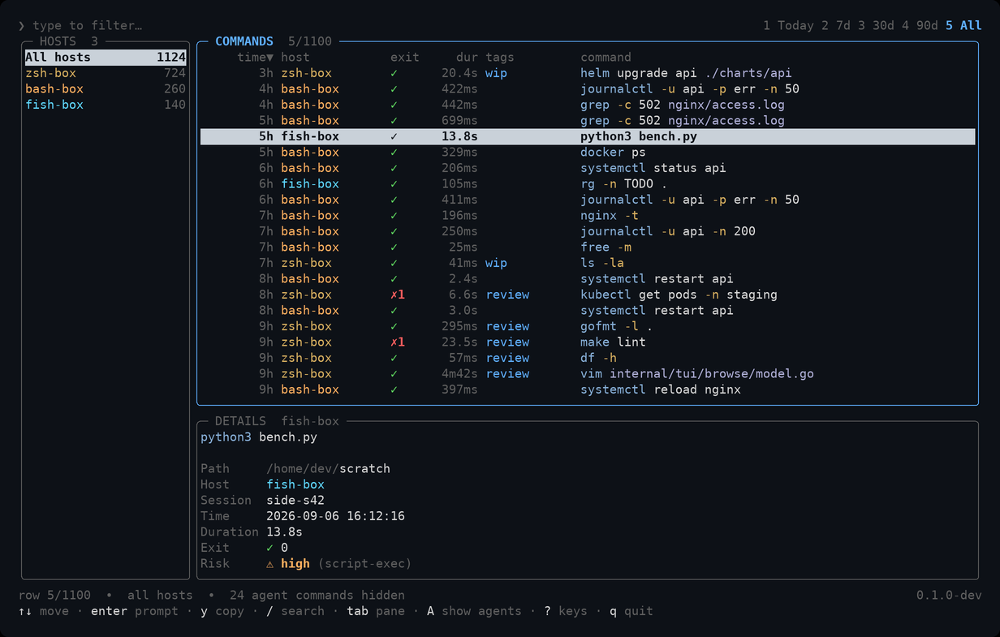
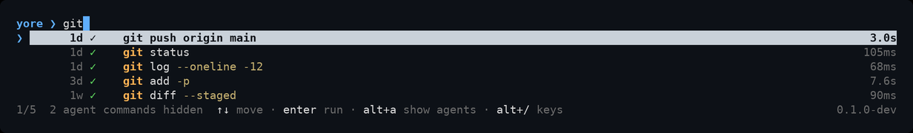
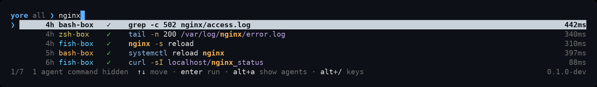
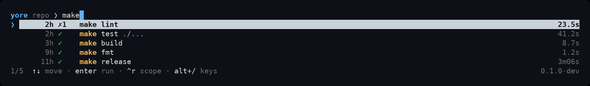
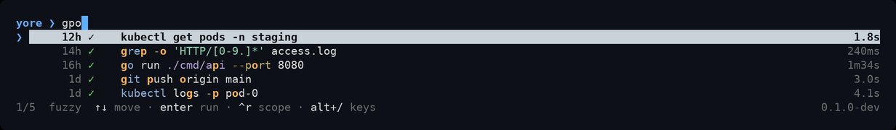
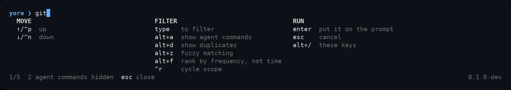
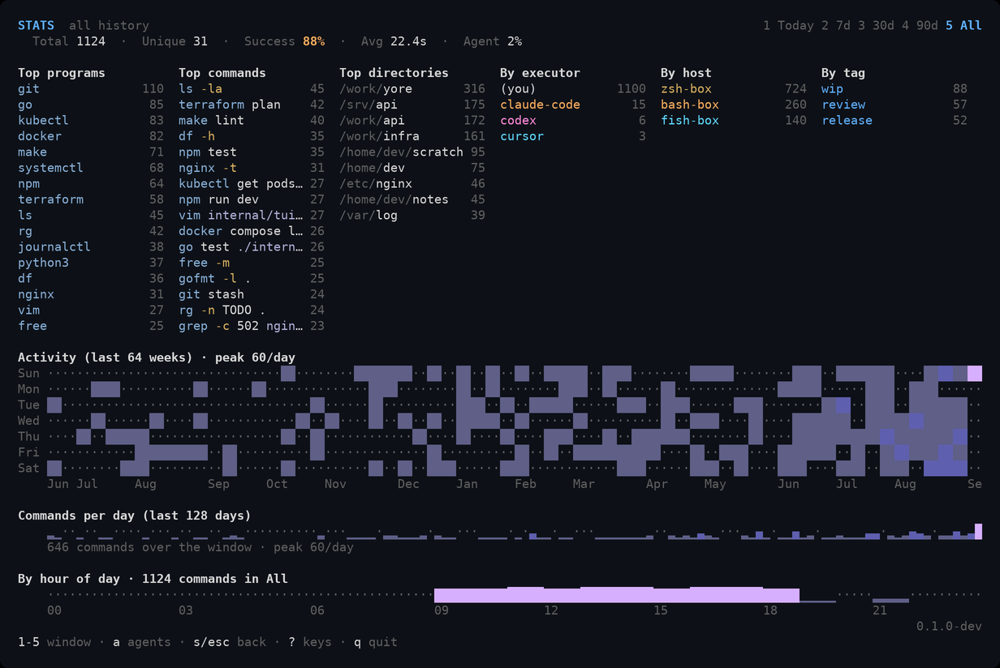
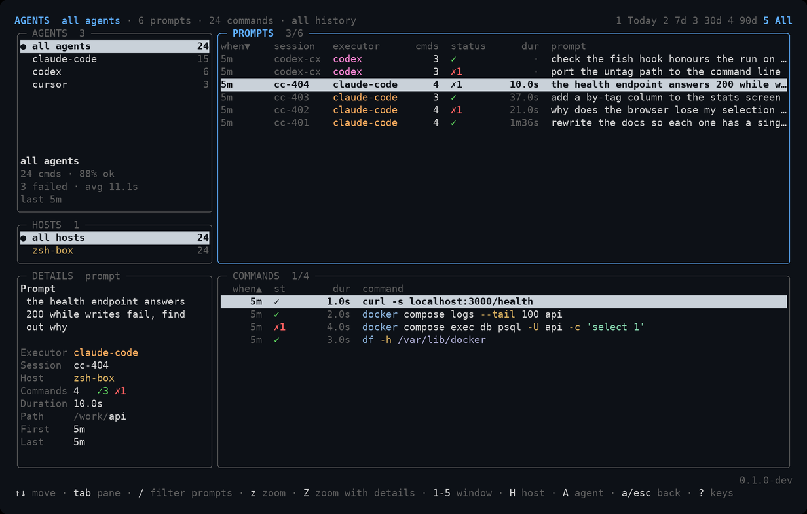

# yore

**Your shell history, on every machine, encrypted, searchable, fast.**

`yore` records every command you run in zsh, bash, and fish, and makes that
history searchable from any machine you use. Point it at a sync server you run
yourself and your machines share one history, encrypted on your machine before
it is uploaded, so the server only ever stores ciphertext.

It also captures what your AI coding agents run (Claude Code, Cursor, OpenCode,
Codex, the Devin CLI) alongside the prompt that caused it, and lets those
agents search your history back.

It is one static binary with no runtime dependencies. The same binary is the
recorder, the search UI, the background service, the importer, and the sync
server.

## What it looks like

The browser, over three machines at once. Which machine ran it, whether it
worked, how long it took and any label you put on it are all in the table; the
pane below adds the directory, the time, and how risky the command is.



`Ctrl-R` at the prompt, narrowing as you type. Enter puts the command you pick
on your prompt to edit.



Press `Ctrl-R` again and the same panel searches every machine you own, saying
which one ran what.



Again for this shell's session, again for this directory, and again for this
git repo, which finds what you ran anywhere under it.



`Alt-Z` matches a subsequence instead of a substring, so `gpo` is enough to
find `git push origin main`, and each row marks the letters it matched on.



`Alt-/` names the rest of them.



`yore stats`: what you run, where you run it, and when.



`yore agents`: every prompt an agent was given, and the exact commands it ran
for each one.



The history in these is invented, not anyone's.

## Install

Requires Go 1.26+ to build:

```bash
git clone <repo-url> && cd yore
make build && sudo install -m755 bin/yore /usr/local/bin/yore
```

`make release` cross-compiles Linux and macOS (amd64 and arm64) plus FreeBSD
(amd64). WSL runs the Linux build; native Windows is not supported.

## Set up your shell

Add one line to your shell config, **after** any `HISTFILE` / `SAVEHIST`
settings of your own:

```bash
# ~/.zshrc
eval "$(yore init zsh)"

# ~/.bashrc
eval "$(yore init bash)"
```

```fish
# ~/.config/fish/config.fish
yore init fish | source
```

Open a new shell and you have fast, searchable, secret-free local history. Press
`Ctrl-R` to search it.

By default yore takes over as your shell's history: your shell stops writing its
own plaintext history file, and `!!`, `!N`, and Up-arrow work against yore's
copy instead. If you would rather leave your shell's history alone, use
`yore init --mode coexist` (record and add the search UI, change nothing else)
or `--mode capture` (record only).

### Bring your old history with you

```bash
yore import auto
```

This is safe to run more than once; re-importing the same file adds nothing.

One caveat on timestamps: zsh's extended history stores a time per command, but
bash only does if `HISTTIMEFORMAT` was set in the shell that wrote the file. A
default `~/.bash_history` has no times in it at all, so those commands import
with an unknown time (shown as `·`). `yore import` tells you when this happens.
The times are not recoverable afterwards, so set `HISTTIMEFORMAT` to get them on
future commands.

## Sync across machines

Sync is optional. You host the server yourself; it never sees anything but
ciphertext.

On a server your machines can reach, with Docker Compose:

```bash
cd docker/compose
printf 'YORE_TOKEN=%s\n' "$(openssl rand -base64 32)" > .env && chmod 600 .env
docker compose up -d --build
```

That listens on `127.0.0.1:8080`; put your reverse proxy in front of it to
terminate TLS. On Docker Swarm instead:

```bash
openssl rand -base64 32 | docker secret create yore_token -
docker build -f docker/Dockerfile -t yore:latest .
docker stack deploy -c docker/swarm/stack.yml yore
```

Then on your first machine:

```bash
yore setup
```

This forms the group and prints a **recovery phrase**. Write it down. It is
shown once, never stored, and it is the only way back in if you lose every
machine.

Every machine after the first needs a single-use invitation from one that is
already in:

```bash
yore devices token          # on a machine already enrolled: prints a token
yore setup --token <token>  # on the new machine: registers it as pending
yore devices                # back on the first machine: select it, press a,
                            # and check the verification code matches
```

`yore devices` is also where you manage the group: which machines are enrolled,
which invitations are still outstanding and how long they have left, `x` to
cancel an invitation or revoke a machine, `S` to refresh.

Lost every machine? `yore recover` asks for the recovery phrase and re-enrolls.

Your device key is kept in your OS keyring where one is available, and in a
`0600` file otherwise (headless servers, containers).

Multi-tenant hosting, backups, and the full server configuration are commented
in [`docker/compose/compose.yml`](docker/compose/compose.yml) and
[`docker/swarm/stack.yml`](docker/swarm/stack.yml), and specified in
[`docs/protocol.md`](docs/protocol.md). There is a local container playground in
[`docker/sandbox/`](docker/sandbox/).

## What you get

**`Ctrl-R` search.** Type to filter. Press `Ctrl-R` again to cycle the scope:
this machine, every machine, this session, this directory, this git repo.
`Alt-Z` matches a subsequence instead of a substring, `Alt-F` ranks by how
often you run something rather than how recently, `Alt-A` brings in the
commands your agents ran, `Alt-D` stops folding repeats together, and `Alt-/`
lists every key. Enter puts the command on your prompt to review; set
`enter_executes` if you would rather it just run.

**`yore browse`, the browser.** A full-screen view of your history with four
screens:

- the **command table**, with a host sidebar and a details pane;
- **stats** (`s`): totals, top commands and directories, an activity heatmap, a
  daily trend, and an hour-of-day histogram;
- the **agent explorer** (`a`): every agent prompt and the exact commands it
  triggered, filterable by agent and by machine;
- **devices** (`D`): enrolled machines and outstanding invitations.

Any pane zooms to full screen with `z` or resizes by dragging its border, and
the sizes you choose are remembered. `c` shows, hides, and sorts columns in
whichever list you are in, also remembered. `1`–`5` narrows every screen to
today, 7, 30, or 90 days, or everything. `?` lists every key that works on the
screen you are on.

`Enter` recalls a command, `y` copies it, `space` checks rows and `ctrl+a`
checks everything shown, so `d` deletes, `Ctrl+T` tags, or `Ctrl+X` untags the
whole selection at once. A bulk untag only asks about the checked rows that
actually carry the tag, so the count it reports is the number that changed.
`yore stats` and `yore agents` open straight onto those screens.

**Search from scripts.** `yore search --headless <query>` prints matching
commands as plain lines for pipes, and `--scope all|session|cwd|workspace`
picks what it searches.

**Short names for all of it.** `yore init` also installs a handful of aliases,
so the things you reach for most are two keystrokes: `hb` for `yore browse`,
`hs` for `yore search`, and `hsa`, `hss`, `hsc`, `hsw` for that search over
all machines, this session, this directory, and this git repo. They are
wrappers and nothing more; every one of them has a `yore` command behind it,
and `yore init --no-aliases` leaves them out. yore never touches `h`.

**Secrets stay out of your history.** A default-on filter catches credentials
(API keys, tokens, passwords on command lines, and the same things stated in an
agent prompt) and masks just the credential, keeping the rest of the command:

```
export DB_PASSWORD=⟪redacted:generic-token-assign⟫
```

You keep the history; the secret is never written down or uploaded. The rules
live in `~/.config/yore/redact.yml` and you can edit them.

**Tags.** Label commands or whole sessions (`yore tag add refactor`), take a
label back off (`yore tag rm refactor`), and filter by them
(`yore search --tag refactor`, or `T` in the browser). Tagging a session covers
everything that shell has already done and everything it does next. `auto_tags`
labels by directory, and `yore stats` grows a **By tag** column once anything is
tagged.

**AI agent capture.** `yore init claude-code` (or `cursor`, `opencode`, `codex`,
`devin`) installs that agent's own hooks, so commands it runs in non-interactive
shells are captured too, with the prompt that caused them, the exit status, and
how long they took. The same command registers a local, read-only MCP server so
the agent can search your history across every machine you own: what you have
run before, what failed, what a command does. It can also ask how risky a
command is: yore rates commands `safe` through `critical` from a fixed set of
rules you can extend in `~/.config/yore/risk.toml`. That rating is advisory. It
labels history; it never blocks anything.

`yore uninit <agent>` reverses any of it, removing only yore's own entries and
leaving the rest of the agent's configuration alone. `yore doctor` shows what is
wired up.

**Diagnostics.** `yore doctor` checks your setup end to end; `yore status` shows
the daemon and sync state.

Everything is configured in `~/.config/yore/config.toml`, or with
`yore get-config <key>` and `yore set-config <key> <value>`. Every key and
default is listed in [architecture.md](docs/architecture.md). All state lives
under `~/.config/yore/`.

## Security, honestly

yore encrypts your history on your machine before it leaves, using standard,
well-regarded primitives, and the full design, every byte on the wire, is
written down in [`docs/protocol.md`](docs/protocol.md) so you can judge it for
yourself.

But be clear about what that is and is not:

- **It has not been audited.** No independent review, no pentest. It is a
  best-effort design by someone who cares about getting it right, not a
  reviewed security product. **Use it at your own risk.**
- **It is meaningfully better than what you have now.** A plaintext
  `~/.zsh_history` is readable by anything that can read your disk, and a
  history sync service that can read your commands is a service that can leak
  them. yore is a real improvement on both.
- **It is not proof against a determined attacker with access to your
  machine.** Your device key is on your machine, and the daemon holds decrypted
  history in memory. yore protects history in transit and at rest on the
  server; it cannot protect a machine that is already compromised.
- **The secret filter is pattern-based, so it is not exhaustive.** It catches
  the common shapes of credentials, and it will miss a secret shaped like
  nothing it knows. Treat it as a strong safety net, not a guarantee.

If you need audited guarantees, yore is not that. If you want your shell history
off a plaintext file and off other people's servers, it does that well.

## How it compares

[Atuin](https://atuin.sh) is the mature, widely used option and a good choice.
[suvadu](https://suvadu.sh) is excellent at structured, agent-queryable history
on a single machine. The differences worth choosing on:

| | **yore** | **Atuin** | **suvadu** |
|---|---|---|---|
| Sync across machines | Yes | Yes | No, local only |
| Key model | A key per device; no master key to copy | One key you copy to each machine | n/a |
| Revoke one machine | Yes, without re-encrypting history | No | n/a |
| Other machines' history on this disk | Ciphertext only | Full plaintext copy | n/a |
| Adding a machine | Single-use invitation, approved out of band | Copy the key over | n/a |
| Agent history for agents to query | Yes, across every machine | Yes, across every machine | Yes, this machine |

The short version: yore's difference is the key model. Everything else it does,
one of the other two also does well. If you don't need per-device keys and
per-device revocation, Atuin is more mature. If you only ever work on one
machine and want structured history for agents, suvadu is built for exactly
that.

## Everyday use

| You want to… | Do this |
|---|---|
| Search and recall a command | `Ctrl-R` (or Up-arrow), type, `Enter` |
| Re-run a command by number | `!N`, `!!`, `!$` |
| Change search scope | `Ctrl-R` again inside the search |
| Browse, get stats, follow agents, manage devices | `yore browse` (alias `hb`), then `s`, `a`, `D` |
| See every key on the screen you're on | `?` in `yore browse`, `Alt-/` in `Ctrl-R` |
| Read your history without agent noise | nothing; agent commands are hidden by default (`A` shows them) |
| Jump to stats or the agent explorer | `yore stats`, `yore agents` |
| See an agent's prompt and what it ran | `yore agents`; `Tab` cycles panes |
| Filter one machine's agent work | `H` in `yore agents` |
| Narrow to a time window | `1`–`5` for today, 7d, 30d, 90d, all |
| Give one pane the whole screen | `z` |
| Resize panes | drag the border with the mouse |
| Delete, tag, or untag several commands | `space` to check rows (`ctrl+a` for all), then `d`, `Ctrl+T`, or `Ctrl+X` |
| Search from a script | `yore search --headless <query>` (alias `hs`) |
| Type less | the aliases `hb`, `hs`, `hsa`, `hss`, `hsc`, `hsw` wrap the commands above |
| See only what an agent ran | `yore search --executor claude-code` |
| Tag and filter by tag | `yore tag add refactor`, `yore search --tag refactor` |
| Take a tag back off | `yore tag rm refactor --command <id>` (or `--session <id>`), or `Ctrl+X` in the browser |
| See what your tags cover | `yore tag list` (`--scope all` for every machine), or the **By tag** column in `yore stats` |
| Force a sync now | `yore sync`, or `S` in the browser |
| Add a machine | `n` in `yore devices`, then `yore setup --token …` there, then `a` to approve |
| Approve or revoke a machine | `yore devices`; `a` or `x`, both ask first |
| Get back in after losing every machine | `yore recover` |
| Check your setup | `yore doctor`, `yore status` |
| Stop the daemon or server | `yore stop`, `yore server stop` |

## Uninstall

Remove the `eval "$(yore init …)"` line from your shell config (or the
`yore init fish | source` line), reopen your shell, then:

```bash
yore uninit claude-code       # and cursor / opencode / codex / devin
rm -f /usr/local/bin/yore
rm -rf ~/.config/yore
```

`uninit` removes only yore's hooks and MCP entry from each agent's config and
leaves everything else, including the agent's own credentials, untouched.

## Docs

- [`docs/architecture.md`](docs/architecture.md): how it is built and why.
- [`docs/protocol.md`](docs/protocol.md): the sync API, the crypto scheme, and
  the local daemon protocol, in exact detail.
- [`CONTRIBUTING.md`](CONTRIBUTING.md): build, test, and the CI gates.
- [`LICENSE`](LICENSE): MIT.
</content>
</invoke>
